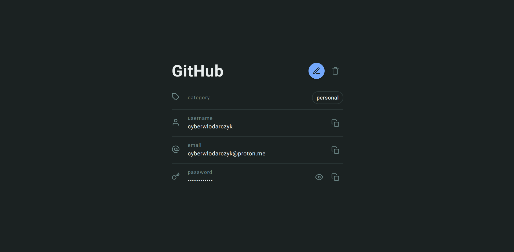

# Voynich 🔑

## Introduction

This is a simple password manager app that uses IndexedDB and SubtleCrypto under the hood to encrypt and store user data in the browser. It is by no means production ready and is for educational purposes only.

## Missing features

Due to lack of time this project lacks very important password manager features, such as:

- Data backup/restore
- Data export/import
- Auto lock
- Auto clear clipboard
- Master password change
- Master password hint
- Vault search/filter

## Contributing

If you would like to contribute to the project, feel free to fork the repository and submit a pull request.

## License

This project is licensed under the [MIT License](https://opensource.org/license/mit/) - see the [LICENSE](LICENSE) file for details.
